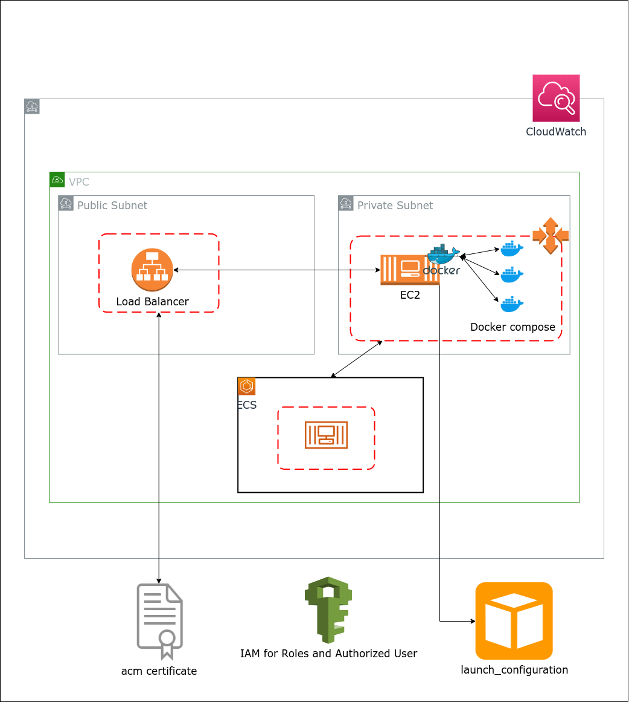

# Terraform Jisti Setup
Jitsi is a set of Open Source projects that allows you to easily build and deploy secure videoconferencing solutions.

Jitsi Meet is a fully encrypted, 100% Open Source video conferencing solution that you can use all day, every day, for free — with no account needed.

This repository contains the terraform script to setup jitsi now AWS.

### AWS Resources covered in this setup
- VPC (Public Subnet, Private Subnets, Security Group)
- ECS container with EC2 as a container instance(ECS container, 1 ECS Task Definition)
- EC2 Lunch Configuration 
- Security Groups
- IAM role, Instance Role, and Instance Profile
- Auto Scaling and Load Balancer 



## Setup Terraform 
- If you don't have Terraform set up on your machine(Local or ec2) please follow this link to configure
[Download Terraform](https://www.terraform.io/downloads.html)
[Configure Terraform](https://learn.hashicorp.com/tutorials/terraform/install-cli)

## Setup Terraform user profile
- Open `provider.tf`
- Add the AWS-CLI profile name the same as we add a profile for s3 backend configuration.
```
provider "aws" {
  region  = "${var.region}"
  profile = "<AWS-CLI PROFILE NAME>" //If you run this script using AWS EC2 of CodePipeline remove this line
}
```
## Add terraform.tfvars file
- If setting up the first time, copy the sample variables to terraform variables.
```
cp terraform.sample.tfvars terraform.tfvars
```
It will create `terraform.tfvars` file.
##### Note: we need to run the following command because recently jitsi update their security policy so we need to pass a strong password
-

```
./gen-passwords.sh
```
It will update the value of the following variables of `terraform.tfvars`.
```
JICOFO_COMPONENT_SECRET
JICOFO_AUTH_PASSWORD
JVB_AUTH_PASSWORD
JIGASI_XMPP_PASSWORD
JIBRI_RECORDER_PASSWORD
JIBRI_XMPP_PASSWORD
```
These variables are used in the task definition file.
- [terraform.tfvars](./terraform.tfvars) has all the required environment variables required for the terraform setup. 
- Once all changes done we are ready to deploy our terraform.
- Run `terraform plan` to verify all created resources.
- Run `terraform apply` to create all resources on the AWS account given region.
- If you want to delete infrastructure run `terraform destroy`.